# Top 12 AI Video Repurposing Tools Ranked in 2025 (Latest Compilation)

If you're drowning in hours-long footage and watching your competitors pump out clips like a content factory, you're not alone. The gap between "I have great content" and "people are actually seeing my content" often comes down to one thing: how fast you can turn that 60-minute recording into 30 snackable pieces without losing your mind or hiring a full editing team.

These AI video repurposing tools can analyze your long videos in seconds, automatically identify the moments that actually matter, slice them into platform-ready shorts, add captions that boost watch time, and resize everything for TikTok, YouTube Shorts, Instagram Reels, and LinkedIn—all before you finish your coffee.

---

## **[Vidyo.ai](https://vidyo.ai)**

Your all-in-one command center for social media AI.

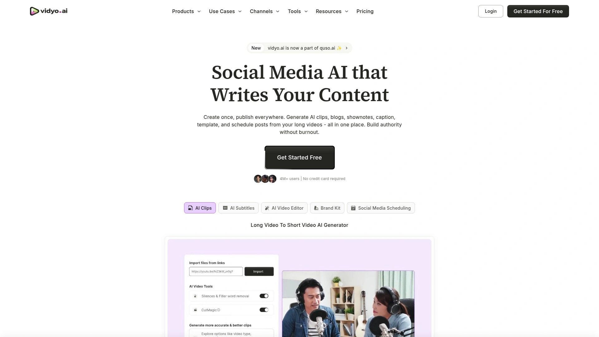

What started as a focused video clipping tool has evolved into quso.ai, a complete social media management suite that still delivers the core AI editing magic vidyo.ai was known for. The platform now handles everything from auto-generating clips and blogs to scheduling posts across multiple platforms, but the heart remains the same: turning your long videos into short, shareable content without the manual grind.

The workflow feels surprisingly intuitive even for AI newcomers. Upload a video up to 15GB (paid users) or 5GB (free users) in mp4, m4v, mov, or webm format, or simply paste a YouTube link. The AI transcribes your content, identifies the best moments, adds auto-subtitles, and prepares clips optimized for each platform. You can enhance storytelling with the integrated royalty-free B-roll library covering stock images, videos, and audio.

Language support currently includes English, Spanish, German, and French, with more languages rolling out soon to reach wider audiences. For coaches, educators, podcasters, business owners, and video content creators looking to increase reach on social media, this represents a rare combination of power and accessibility. The free trial with limited credits gives you enough runway to test the waters before committing.

---

## **[OpusClip](https://www.opus.pro)**

The viral-moment hunter with a built-in scorecard.

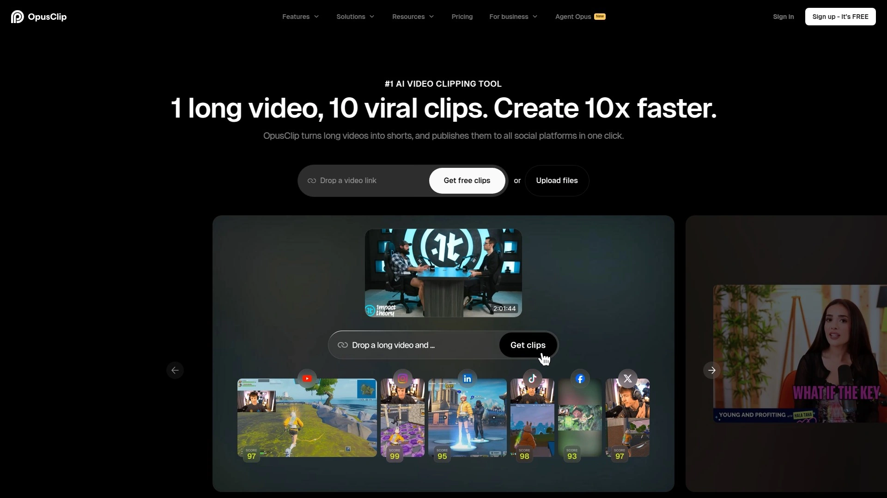

OpusClip uses powerful AI models designed to work across any genre, automatically turning long videos into shorts with minimal input required. What sets it apart is the virality score feature—each generated clip gets rated on its potential to perform well on social platforms, giving you a data-driven signal about which pieces to prioritize. The AI clipping accuracy reportedly exceeds 97% for transcription, capturing nearly every word and nuance.

The platform handles auto-reframing to keep speakers centered in frame, animated captions to boost engagement, and AI-generated B-roll that adds visual depth without extra shooting. Genre-specific AI clipping in version 3.0 means the tool understands whether you're editing a podcast, tutorial, vlog, or webinar and adjusts its approach accordingly. You can generate both short clips (under 60 seconds) and mid-form content (3-15 minutes) from a single upload.

Processing speed improved by 300% in the latest update, and you can export clips directly to professional editing software if you want to add final touches. OpusClip supports over 20 languages for captions, expanding your potential audience significantly. Team workspace features enable collaboration, while brand templates ensure visual consistency across all outputs.

---

## **[Reap](https://www.reap.video)**

Multi-signal analysis that finds the moments algorithms miss.

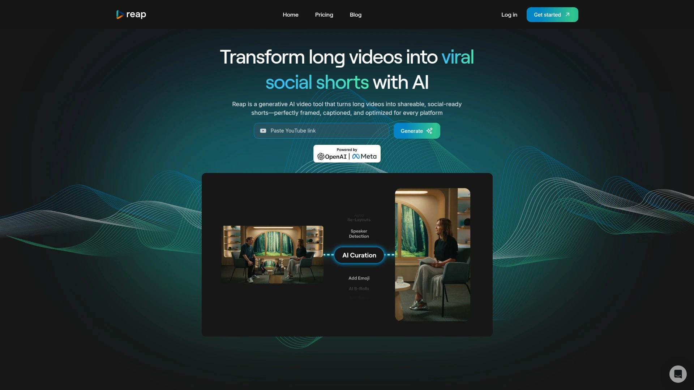

Reap employs an advanced detection system combining face tracking, voice tone shifts, beat detection, and speech cues to automatically identify and extract compelling moments without awkward mid-sentence cuts. This multi-signal approach results in cleaner, more naturally flowing clips compared to tools that rely solely on volume or motion triggers.

The platform ranks as a top choice specifically for creators who need sophisticated clip curation married to straightforward controls. Transcript-based editing allows you to cut videos by simply modifying text—no timeline scrubbing required—making it accessible even if you've never touched editing software before. AI-powered noise removal cleans up background audio automatically, enhancing production value without manual filtering.

Multi-platform optimization instantly resizes videos for Instagram, TikTok, YouTube, and LinkedIn with correct aspect ratios (9:16, 16:9, 1:1) for each destination. The AI video translation and voice dubbing features extend your reach into new language markets without additional production costs. Auto-captions with speaker detection ensure your content remains engaging even when viewers watch without sound. B-roll suggestions inject dynamic visual variety that strengthens storytelling.

***

## **[Vizard.ai](https://vizard.ai)**

Data-driven clip optimization powered by pattern recognition.

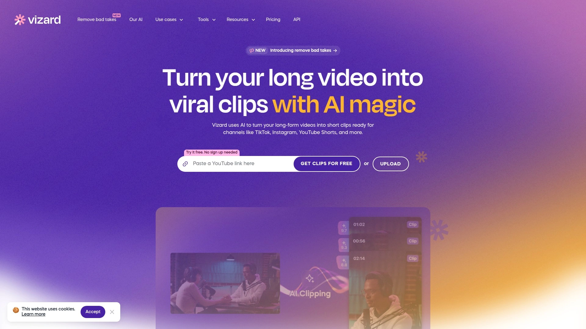

Vizard stands out by analyzing millions of viral clips across platforms to develop pattern recognition that identifies moments with genuine engagement potential. Unlike tools that rely on surface metrics like volume or motion, Vizard's system understands what actually resonates with audiences based on aggregated performance data. This translates to consistently better clip selection over time as the system learns your specific audience and brand voice.

The predictive engagement scoring gives you a forecast of how each clip might perform before you publish, letting you prioritize high-potential content. Platform-native optimization ensures each clip follows the unwritten rules and best practices for its destination—what works on LinkedIn differs from TikTok, and Vizard adjusts accordingly. Starting price sits at free for basic use, with paid tiers beginning at $16/month for more advanced features.

Auto-generated clips can be produced 30+ at a time from a single upload, dramatically expanding your content library from one source video. The tool excels particularly for data-driven creators who want to scale impact without proportionally scaling production costs.

***

## **[Descript](https://www.descript.com)**

Edit video by editing a document.

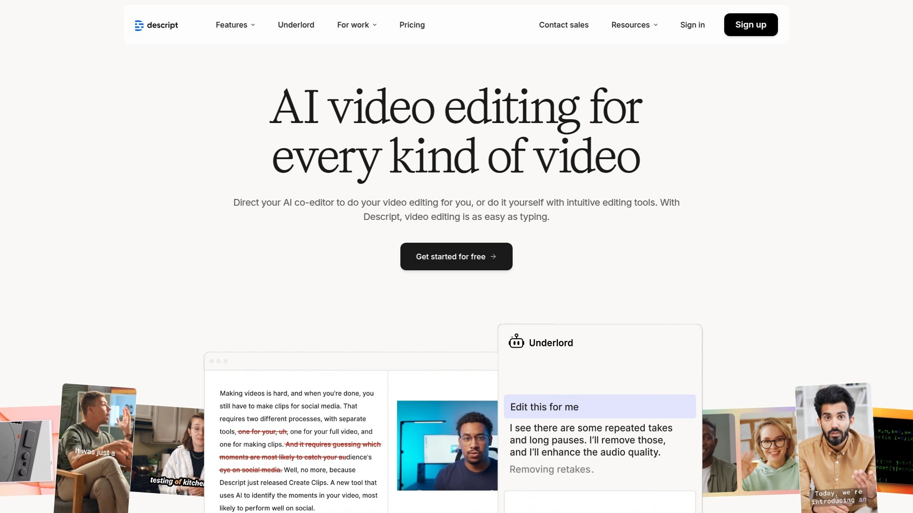

Descript revolutionizes the editing process by automatically transcribing your footage and letting you cut, move, or delete sections simply by modifying the text transcript. This approach feels natural for anyone comfortable with word processors but intimidated by traditional timeline editors. You can treat video editing exactly like editing a Google Doc—highlight and delete unwanted words, and the video updates automatically.

The Underlord AI assistant takes things further by accepting plain-language prompts like "repurpose this video into a 15-second TikTok using the most engaging parts" or "add chapter markers to split this into digestible chunks". Overdub, the AI voice cloning tool, can generate missing voice lines based on a speaker's real voice, fixing mistakes without requiring complete re-recording sessions.

Multitrack editing through the Sequence Editor allows layering audio, video, and on-screen graphics (text, GIFs, stickers) separately, giving you professional control while maintaining beginner accessibility. Pricing starts at $12/month, making it one of the more affordable options for feature-rich editing. The tool isn't built for complex cinematic sequences, but for short-form content, online education, and content marketing, it dramatically reduces production time.

***

## **[Klap](https://klap.app)**

Built specifically to transform long-form into shorts.

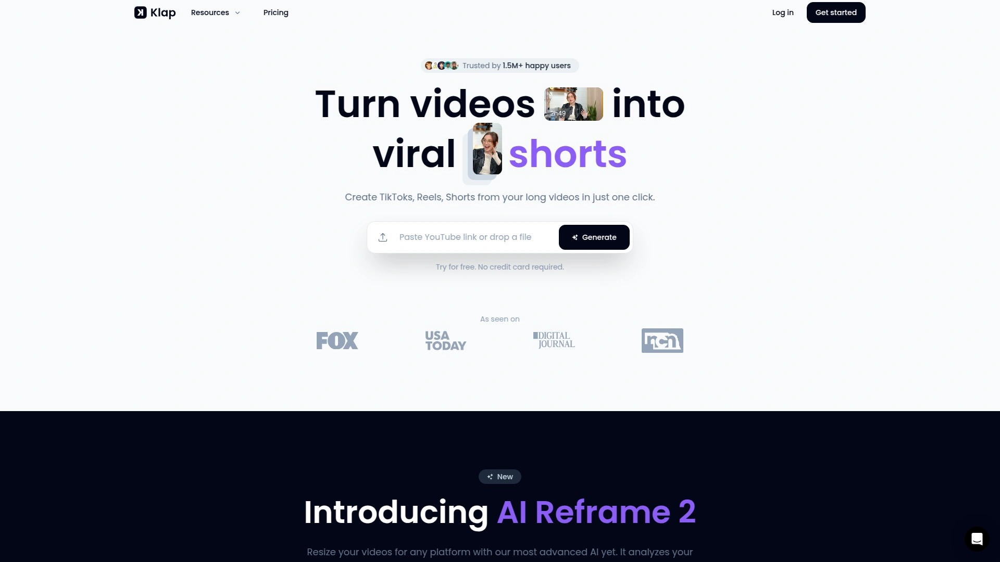

Klap positions itself squarely at the intersection of podcast creators, webinar hosts, and interview producers who need to convert extended content into TikTok, Instagram, and YouTube-friendly clips. AI editing automatically identifies and extracts the most engaging moments from long-form videos, creating short clips that resonate without manual marking or trimming.

Auto-reframing dynamically adjusts focus to ensure the primary subject remains centered, optimizing content for vertical, square, or landscape formats depending on the destination platform. Engaging captions appear automatically with customizable fonts, colors, and branding options to match your visual identity. Multi-language support covers 52 languages for editing and transcription, making the tool accessible to global audiences.

Built-in scheduling tools streamline posting across social media platforms directly from Klap, consolidating your workflow. Pricing ranges from a free plan with one trial video, to Basic at $29/month (10 videos, 100 clips), Pro at $79/month (30 videos, 300 clips with 4K downloads), and Pro+ at $189/month (100 videos, 1,000 clips). The 4K download capability only unlocks on Pro plans and above.

---

## **[Kapwing](https://www.kapwing.com)**

Browser-based collaboration hub with extensive templates.

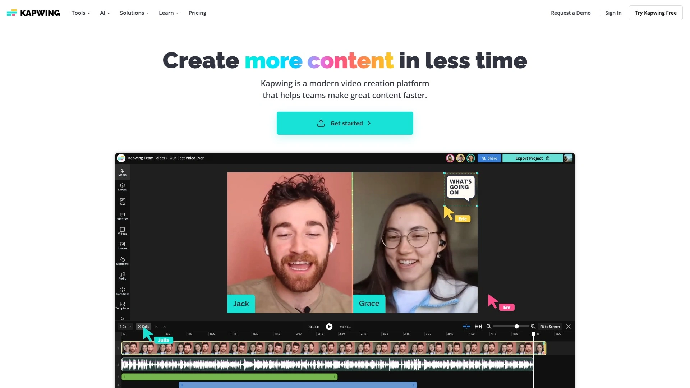

Kapwing eliminates the download barrier entirely as a fully browser-based editor that works across Windows, Mac, iOS, and Android devices. The collaborative features shine for teams—multiple people can leave feedback directly on videos, streamlining reviews without endless Slack threads or email chains. A free tier provides access to core functionality, making it easy to start without upfront investment.

Trim with Transcript follows the text-editing approach: delete words in your transcript to automatically remove or trim that section of the video with no editing experience required. Smart Cut automates the detection and removal of silences from your video in seconds. The AI Resizer instantly optimizes content for different platforms, while Background Remover, Eye Contact correction, and B-roll Generator add polish quickly.

The AI toolkit includes advanced video and image generators, plus a built-in AI Assistant to help refine ideas and pull real-time information for trending topics. Video Translator supports over 100 languages with accurate subtitle translations, natural dubbing, and AI voice cloning for lip-synced videos. Extensive templates give you starting points for different content types, speeding up the creation process.

***

## **[Pictory](https://pictory.ai)**

Script-to-video creation with massive stock footage access.

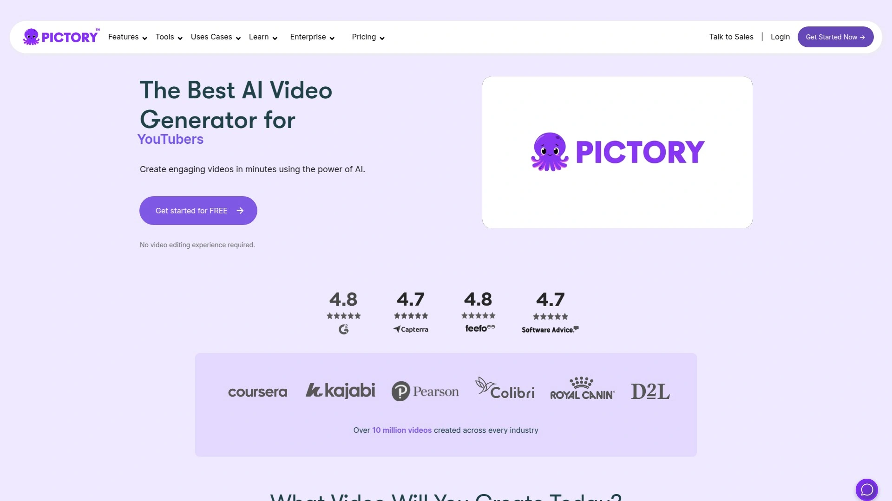

Pictory transforms scripts, articles, blog posts, or visuals into professional videos with just a few clicks. High-quality AI voice narration, subtitles, and captions come built-in, and the tool instantly resizes content for YouTube, vertical shorts, and other social media formats. What makes the value proposition compelling is access to over 3 million high-quality video clips and images from Storyblocks.

A standalone Storyblocks subscription normally costs around $30/month, so getting the entire library bundled with Pictory's editing capabilities represents significant savings for creators who regularly need stock footage. The storyboard generation creates visual sequences based on your text input, then lets you customize each scene by selecting different images or video clips, adding background music, and including voiceovers.

Keyword highlighting during script input tells Pictory AI which terms to emphasize more heavily when generating visuals. Pricing starts at $19/month, positioning it competitively for creators who need both editing and asset libraries. The tool works best for text-to-video projects, making it ideal for bloggers, educators, and marketers who already have written content they want to visualize.

***

## **[Spikes Studio](https://www.spikes.studio)**

Designed for YouTube, Twitch, and gaming content.

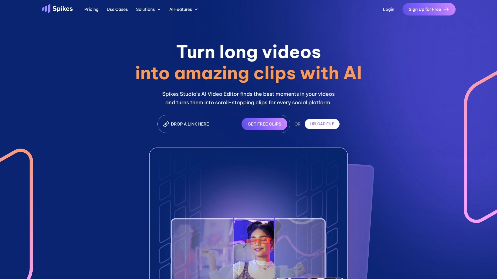

Spikes Studio uses AI to turn long videos into clips while automatically finding best moments, creating smooth transitions, adding captions, and optimizing for social platforms. The tool particularly targets gaming streamers, YouTube creators, and Twitch broadcasters who generate hours of content and need efficient ways to create highlight reels.

The AI understands gaming-specific moments like clutch plays, funny reactions, and competitive highlights, making it well-suited for esports and streaming content where traditional editing tools might miss context. Automated caption generation keeps viewers engaged during muted viewing, which happens frequently on mobile social feeds. Platform optimization ensures clips meet the technical requirements and best practices for TikTok, Instagram Reels, and YouTube Shorts.

---

## **[Wisecut](https://wisecut.video)**

Automated editing plus clipping in one package.

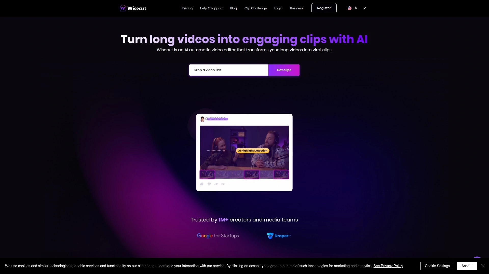

Wisecut combines automated video editing with clip generation, offering jump cut detection that smooths out awkward pauses automatically. Background music automation adds appropriate audio tracks based on the mood and pacing of your content without manual selection. Starting at $10/month, it ranks among the more budget-friendly options while still delivering solid automated editing features.

The tool handles both the macro task of identifying clip-worthy segments and the micro task of polishing those segments through automated editing techniques. This dual focus makes it appealing for creators who want to minimize time spent on technical details while still producing clean, professional-looking content.

***

## **[Short AI](https://www.short.ai)**

Bulk generation and faceless video creation.

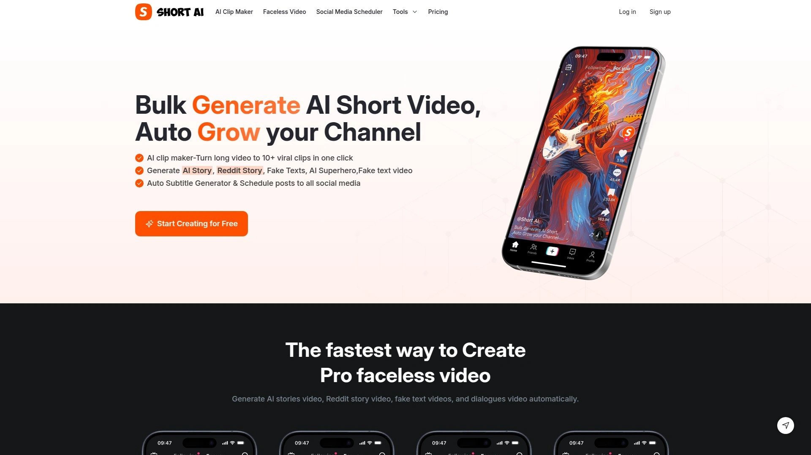

Short AI specializes in bulk video generation—turn one long video into 10+ viral clips with one click. The platform automatically generates AI stories, Reddit story videos, fake text videos, and dialogues video content, targeting creators who want to produce faceless YouTube channels and grow rapidly without appearing on camera.

The auto subtitle generator delivers the same dynamic caption styles used by popular creators like Alex Hormozi and Grant Cardone. Over 99% speech-to-text accuracy across 32+ languages ensures captions remain reliable across diverse content. Scheduled posting saves significant time by allowing you to queue content to TikTok, YouTube, Twitter, Facebook, Instagram, LinkedIn, and Pinterest from one interface.

Script generation with strong hooks, editable scenes, and detailed shots helps overcome writer's block. You can paste a URL or choose from 50+ script templates inspired by viral hashtags, streamlining the ideation process. Users report creating a week's worth of content in one sitting, something that previously consumed entire days.

***

## **[Submagic](https://www.submagic.co)**

Dynamic captions and emoji highlights.

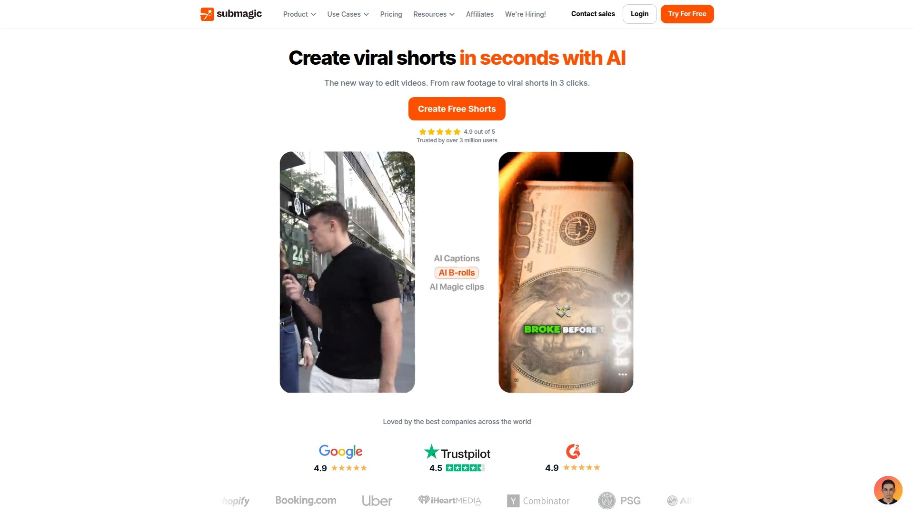

Submagic focuses heavily on caption styling and visual engagement elements that stop scrollers mid-swipe. The platform offers 14+ dynamic caption styles, plus emoji, GIF, and image highlights that get layered onto your video to boost viewer retention. This approach targets creators who understand that captions aren't just accessibility features—they're engagement drivers that can dramatically improve watch time.

Auto-generated captions appear quickly with high accuracy, and the styling options let you match your brand aesthetic or experiment with trending caption formats. The tool integrates well into repurposing workflows where you're already generating clips with other tools but want to add that extra polish layer before publishing.

---

## FAQ

**How do AI video clipping tools identify the best moments to clip?**
Most advanced tools use multi-signal analysis combining face detection, voice tone shifts, speech cues, and beat detection rather than just volume or motion. Some platforms like Vizard analyze millions of viral clips to develop pattern recognition for engagement potential. The AI learns over time what resonates with specific audiences and adjusts selections accordingly.

**Can these tools handle videos in languages other than English?**
Yes, many platforms support multilingual editing. Klap covers 52 languages for editing and transcription, OpusClip supports over 20 languages for captions, and Kapwing handles 100+ languages including Chinese, Spanish, Hindi, and French with translation and dubbing features. Short AI processes 32+ languages with over 99% accuracy.

**What's the typical time savings when using AI video repurposing tools?**
Creators commonly report saving 10+ hours weekly by automating clip generation, editing, and scheduling in one platform instead of juggling multiple tools. What used to take an entire day—creating a week's worth of content—now gets completed in a single sitting. Processing speeds have improved dramatically, with some tools like OpusClip achieving 300% faster rendering in recent updates.

---

## Conclusion

Turning one long video into dozens of platform-ready clips no longer requires a video editing degree or a team of freelancers. The tools above handle everything from identifying viral moments to adding captions, resizing for different platforms, and scheduling posts. If you're specifically looking for an all-in-one social media management suite that combines clip generation with broader content creation and scheduling capabilities, [Vidyo.ai](https://vidyo.ai) delivers that expanded functionality while maintaining the core video repurposing magic that matters most. The free trial gives you room to test whether the workflow fits your content creation process before any financial commitment.
